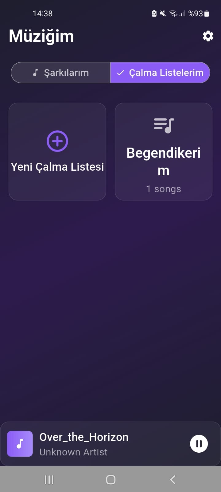
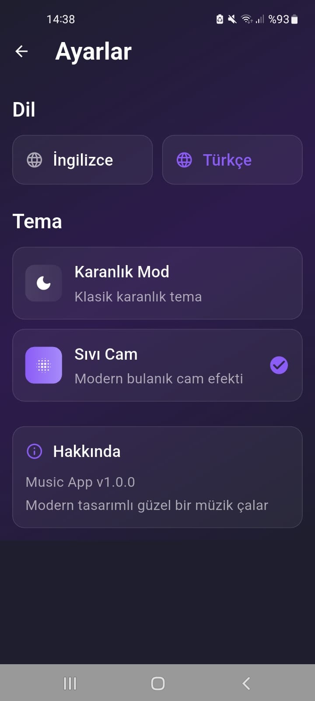
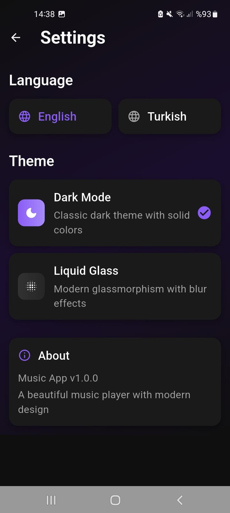
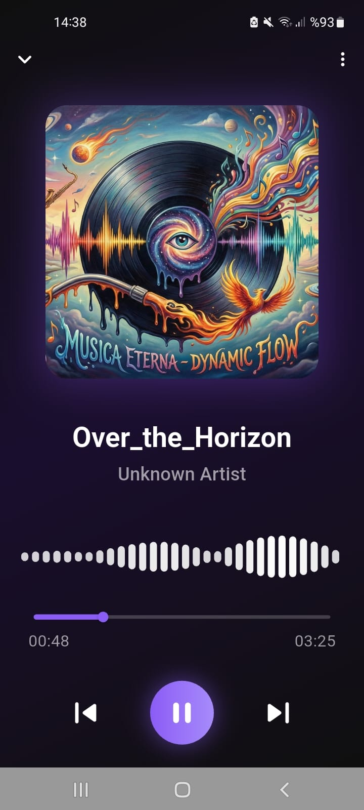

  <h1>🎧 Your Music App</h1>
  
<i>Local music player – Fast, clean, elegant.</i>

  
  
  

---

## 🚀 Özellikler

- 🎵 Lokal müzikleri okuma ve oynatma  
- ⚡ Ultra hızlı performans  
- 🌑 Modern **Dark Mode** tasarım  
- 🧊 **Liquid Glass UI**  
- 📁 Playlist bazlı listeleme  
- 💾 Hafif ve reklamsız  

---

## 📱 Ekran Görüntüleri

<!-- Row 1 -->

<!-- Row 2 -->

